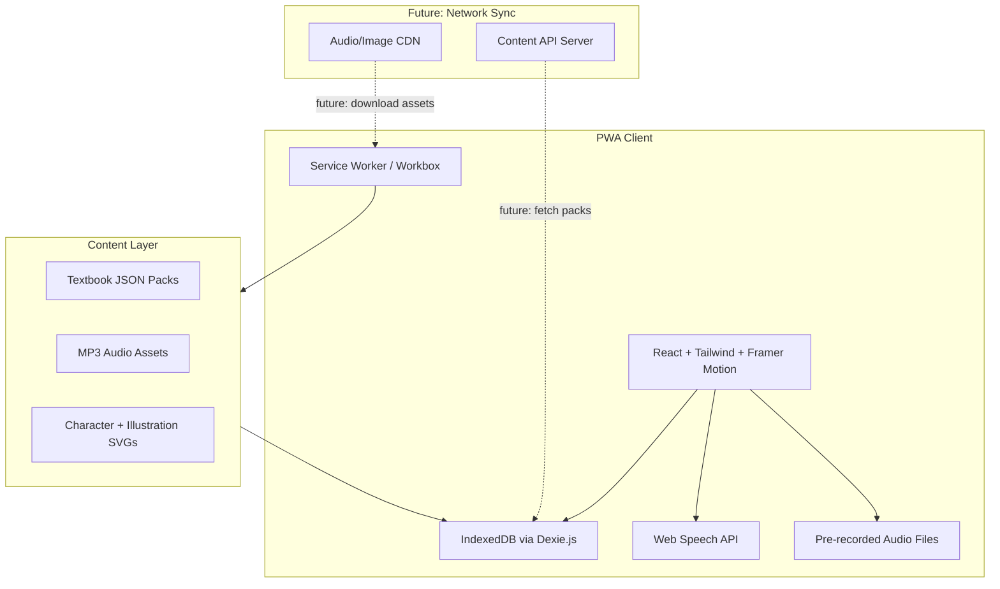
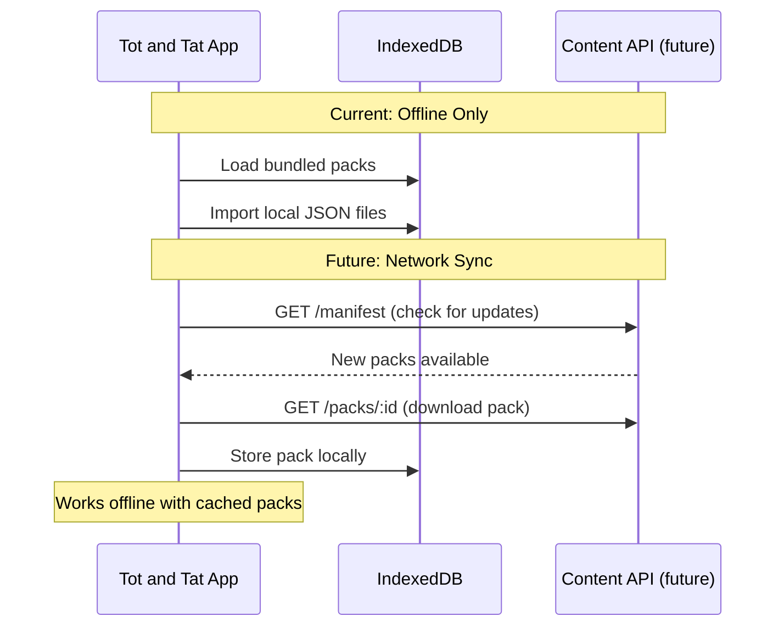

# Tot & Tat - Hong Kong Primary English Learning PWA

## Brand & Characters

- **Tot** (an owl) - the knowledgeable guide, appears in reading and listening exercises, gives encouragement
- **Tat** (a cat) - the playful companion, appears in speaking and writing exercises, celebrates achievements
- **Visual style**: Rounded, colorful, child-friendly illustrations; pastel backgrounds with vibrant accent colors; animated character reactions (happy, thinking, cheering)
- **Tone**: Encouraging, playful, never punishing mistakes - "Try again!" instead of "Wrong!"

## Architecture Overview



## Tech Stack

| Layer | Technology | Reason |
|-------|-----------|--------|
| Framework | **React 18 + Vite** | Fast build, excellent PWA plugin support |
| Styling | **Tailwind CSS** | Responsive design for phone/tablet, utility-first |
| PWA | **vite-plugin-pwa (Workbox)** | Automatic Service Worker generation, precaching |
| Local Storage | **Dexie.js (IndexedDB)** | Structured storage for content packs + progress |
| Speech TTS | **Web Speech API (SpeechSynthesis)** | Built-in iOS, offline on iOS 17+ |
| Speech STT | **Web Speech API (SpeechRecognition)** | Pronunciation practice (iOS Safari support) |
| Audio | **Howler.js** | Reliable cross-browser audio playback |
| Animation | **Framer Motion** | Character animations, transitions, micro-interactions |
| Routing | **React Router v6** | SPA navigation |
| State | **Zustand** | Lightweight state management |
| Language | **TypeScript** | Type safety for content schemas |

## Content Structure (Structured & Extensible)

Content is managed as versioned JSON packs. Each pack is self-contained and can be:
1. **Bundled** in the app build (always offline)
2. **Imported** from a local JSON file
3. **Fetched from network** (future: content API with versioning)

```typescript
interface ContentManifest {
  version: string;          // Schema version for migration support
  lastUpdated: string;      // ISO date
  packs: PackMeta[];        // Available packs (for future network catalog)
}

interface PackMeta {
  id: string;
  name: string;
  publisher: string;
  grade: Grade;
  version: string;          // Pack content version
  size: number;             // Approximate size in KB
  remoteUrl?: string;       // Future: URL to download this pack
}

interface TextbookPack {
  id: string;
  name: string;             // e.g. "Longman Welcome to English 3A"
  publisher: string;
  grade: "P1" | "P2" | "P3" | "P4" | "P5" | "P6";
  version: string;
  units: Unit[];
  assets?: AssetManifest;   // Audio/image references
}

interface Unit {
  id: string;
  title: string;            // e.g. "Unit 1: My Family"
  theme?: string;           // Visual theme hint (animals, food, etc.)
  mascotTip?: string;       // Tot or Tat says something encouraging
  lessons: Lesson[];
}

interface Lesson {
  id: string;
  title: string;
  objectives: string[];     // Learning objectives
  vocabulary: VocabItem[];
  listening: ListeningExercise[];
  speaking: SpeakingExercise[];
  reading: ReadingExercise[];
  writing: WritingExercise[];
}

interface AssetManifest {
  audioBaseUrl?: string;    // Future: CDN base URL
  audioFiles: Record<string, string>;  // id -> filename or URL
  images: Record<string, string>;
}
```

### Future Network Content Sync

The content architecture is designed for future network capability:



## Four Core Modules

### 1. Listening (Hear and Understand)
- Play pre-recorded audio or use TTS for vocabulary/sentences/passages
- Exercises: multiple choice, fill-in-the-blank, dictation, sequence ordering
- Speed control (slow/normal/fast)
- Repeat playback

### 2. Speaking (Pronounce and Express)
- Word/sentence pronunciation practice with model audio
- Record student's voice, playback for self-comparison
- Web Speech API scoring (when available offline on iOS)
- Read-aloud passages with highlighted text

### 3. Reading (Comprehend)
- Graded reading passages with vocabulary highlighting
- Tap-to-hear word pronunciation
- Comprehension questions (MCQ, true/false, matching)
- Vocabulary flashcards with spaced repetition

### 4. Writing (Spell and Compose)
- Spelling exercises (hear word, type it)
- Sentence reordering (drag words into correct order)
- Fill-in-the-blank with word bank
- Simple sentence composition with grammar hints
- Handwriting practice canvas (trace letters/words) for lower primary

## App Structure

```
tot-and-tat/
├── public/
│   ├── manifest.json          # PWA manifest
│   ├── icons/                 # App icons (Tot & Tat branding)
│   ├── audio/                 # Pre-recorded audio assets
│   └── characters/            # Tot (owl) & Tat (cat) SVG assets
├── src/
│   ├── main.tsx
│   ├── App.tsx
│   ├── theme/
│   │   ├── colors.ts          # Playful color palette
│   │   ├── fonts.ts           # Child-friendly typography
│   │   └── animations.ts     # Shared animation variants
│   ├── components/
│   │   ├── layout/            # AppShell, NavBar, TabBar
│   │   ├── characters/        # Tot, Tat, SpeechBubble, Reactions
│   │   ├── listening/         # Audio player, dictation input
│   │   ├── speaking/          # Recorder, waveform, comparison
│   │   ├── reading/           # Passage viewer, flashcards
│   │   ├── writing/           # Spelling input, word ordering
│   │   └── shared/            # Button, Card, Progress, Modal, Stars
│   ├── hooks/
│   │   ├── useSpeechSynthesis.ts
│   │   ├── useSpeechRecognition.ts
│   │   ├── useAudioPlayer.ts
│   │   ├── useAudioRecorder.ts
│   │   ├── useProgress.ts
│   │   └── useContentSync.ts  # Future: network content fetching
│   ├── stores/
│   │   ├── contentStore.ts    # Textbook content state
│   │   ├── progressStore.ts   # Student progress
│   │   └── settingsStore.ts   # App settings (language, avatar)
│   ├── db/
│   │   ├── database.ts        # Dexie.js schema + migrations
│   │   ├── contentRepo.ts     # CRUD for textbook packs
│   │   ├── progressRepo.ts    # CRUD for student progress
│   │   └── syncRepo.ts        # Future: sync state tracking
│   ├── data/
│   │   ├── manifest.json      # Content manifest (bundled packs)
│   │   └── packs/             # Bundled JSON content packs
│   │       └── sample-p3.json
│   ├── types/
│   │   ├── content.ts         # Content schema interfaces
│   │   └── progress.ts        # Progress/scoring interfaces
│   ├── utils/
│   │   ├── scoring.ts         # Exercise scoring logic
│   │   ├── spacedRepetition.ts
│   │   └── contentValidator.ts # Validate pack JSON schema
│   └── pages/
│       ├── Home.tsx           # Welcome screen with Tot & Tat
│       ├── BookShelf.tsx      # Textbook selection (bookshelf UI)
│       ├── UnitMap.tsx        # Units as an adventure map
│       ├── Lesson.tsx         # Lesson hub (4 skill tabs)
│       ├── Exercise.tsx       # Individual exercise view
│       ├── Progress.tsx       # Student dashboard with badges
│       ├── ContentManager.tsx # Import/manage textbook packs
│       └── Settings.tsx       # Profile, language, content sync
├── vite.config.ts             # PWA plugin config
├── tailwind.config.ts
├── package.json
└── tsconfig.json
```

## Offline Strategy

1. **Service Worker precaches** all app shell assets (HTML, JS, CSS, icons)
2. **Audio files** are cached on first access or bundled in the build
3. **Content packs** stored in IndexedDB - survives cache clearing
4. **Progress data** stored in IndexedDB with export/import capability
5. **No network dependency** after initial load + content download

## Content Management (Structured)

Content lifecycle supports progressive enhancement from offline to connected:

| Mode | How it works | Available now? |
|------|-------------|----------------|
| Bundled | JSON packs included in the build, always available | Yes (Phase 1) |
| File import | Teacher uploads a `.json` pack via ContentManager UI | Yes (Phase 1) |
| Network sync | App checks a content API for new/updated packs | Future |
| Live catalog | Browse and download packs from a cloud catalog | Future |

**Content authoring workflow:**
1. Author creates content following the documented JSON schema
2. Validates with the built-in schema validator (or CLI tool)
3. Distributes via file share, AirDrop, or (future) uploads to content API
4. App imports, validates, and stores in IndexedDB

**Content versioning:**
- Each pack has a `version` field (semver)
- When a newer version is available (via network), app shows update badge
- Old versions are kept until user confirms update (no data loss)

## iOS-Specific Considerations

- PWA on iOS Safari: limited to 50MB cache (iOS 16+), plan audio carefully
- Use `apple-touch-icon` and `apple-mobile-web-app-capable` meta tags
- Handle iOS safe areas (notch, home indicator) with Tailwind's `safe` utilities
- Audio autoplay restrictions: require user interaction before first audio play
- SpeechRecognition on iOS Safari has limited offline support - fall back to record-and-compare

## UI/UX Design - Fun & Engaging

### Visual Identity
- **Color palette**: Warm pastels (soft yellow, sky blue, mint green, coral pink) with vibrant accents
- **Typography**: Rounded, friendly fonts (e.g. Nunito / Quicksand for headings, system font for body)
- **Illustrations**: Tot (owl with glasses, scholarly) and Tat (playful cat, energetic) appear contextually
- **Animations**: Bounce, wiggle, confetti on correct answers; gentle shake on retry; character expressions change

### Interaction Design
- **Large tap targets** (min 48px) - Primary school students have smaller hands
- **Swipe navigation** between exercises within a lesson
- **Tab bar** with 4 skill icons + home (mascot faces as icons)
- **Adventure map** for unit progression (path with nodes, unlockable stages)
- **Bookshelf metaphor** for textbook selection (books on a shelf, pull to open)

### Reward System
- **Stars** (1-3) per exercise based on accuracy
- **Streaks** - daily practice counter with Tat cheering
- **Badges** - themed achievements (e.g. "Word Wizard", "Super Listener")
- **Tot's tips** - character gives study suggestions based on weak areas
- **Celebration animations** on milestone completion (confetti, fireworks, dancing mascots)

### Responsiveness
- **iPhone** (portrait): Single-column, bottom tab bar, full-width cards
- **iPad** (landscape): Side navigation, split view for reading, larger exercise areas
- **Bilingual UI** (EN/繁中): Toggle in settings, all UI chrome supports both

## Deployment

- Host on any static hosting (GitHub Pages, Netlify, Vercel, or school server)
- Users visit the URL in Safari, tap "Add to Home Screen"
- App works fully offline after the initial load
- Updates happen automatically when the user opens the app with network available

## Phase Plan

**Phase 1 - Foundation + Brand (MVP)**
- Project setup (Vite + React + Tailwind + Framer Motion + PWA)
- Tot & Tat character components (SVG mascots with expressions)
- Color palette, typography, and animation system
- Content schema + sample P3 content pack + validation
- Home screen (welcome with characters) + BookShelf + UnitMap
- Reading module (vocabulary + passage + MCQ)
- Offline caching fully working

**Phase 2 - Listening + Speaking**
- Audio playback with TTS and pre-recorded assets
- Listening exercises (dictation, MCQ, ordering)
- Audio recording for speaking practice
- Record-and-compare pronunciation UI
- Tot guides listening, Tat encourages speaking

**Phase 3 - Writing + Gamification**
- Spelling exercises (hear and type)
- Sentence ordering (drag and drop)
- Fill-in-the-blank with word bank
- Progress tracking + star scoring
- Badges, streaks, celebration animations

**Phase 4 - Content Management + Network Ready**
- Content import/export UI (ContentManager page)
- JSON schema documentation for content authors
- Content validator utility
- Network sync hooks (prepared but optional)
- iPad-optimized layouts
- Bilingual UI toggle (EN/繁中)
- Settings page with profile customization
